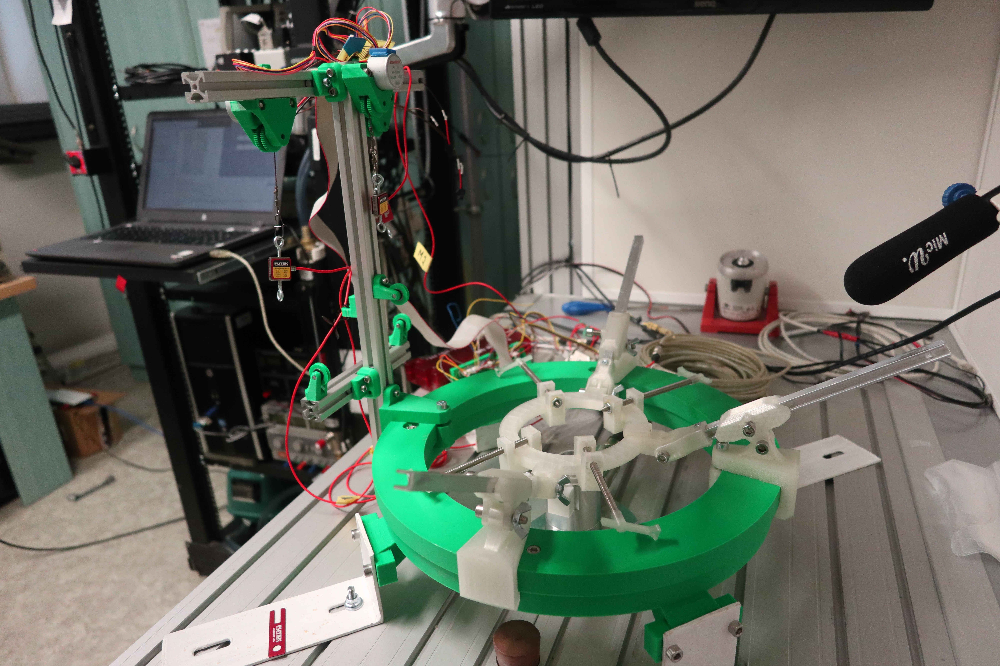
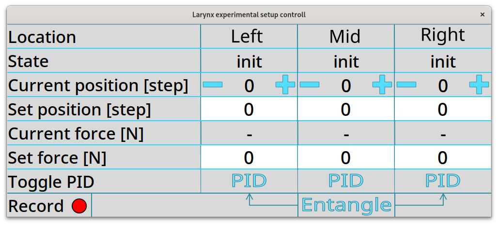

# HRT
This project was developed as an enhancement to an existing experimental setup to study a voice production at excised larynx specimens. This experiment is based at voice research laboratory which is part of experimental physics department at Palacky University in Olomouc. 

 - The voice research lab and the experiment is led by Jan Švec: jan.svec@upol.cz
 - The project author is Antonín Lindner: antonin.lindner01@upol.cz 
 
But big credits also becomes to:
 - Lukáš Kouřil: lukas.kouril@upol.cz
 - Petr Hájek: petr.hajek@upol.cz
 - Hugo Lehoux: hugo.lehoux@upol.cz

## Desctiprion
The project is written in Python 3.xx solely for Linux operating system as the Windows does not suppor the used multithreading (iOS was not tested).

## Python Modules Used
Here is the list of Python modules used in this project:
 - numpy
 - scipy
 - pandas
 - matplotlib
 - threading
 - queue
 - json
 - csv
 - tkinter
 - u6 (from [LabJack python library](https://github.com/labjack/LabJackPython))
 - simple_pid

Please make sure to install these modules before running the project.

## Usage
To calibrate the forcemeter the script [futek.py](futek.py) is used.
Based on position of the forcemeter, use:

- `python3 futek.py l` to calibrate left winder
- `python3 futek.py m` to calibrate middle winder
- `python3 futek.py r` to calibrate right winder

Before starting the calibration process, make sure there is no load on the forcemeter and leave it hanging. When the calibration process is started, data for no force are taken so make sure to not affect the masurement. After that, the program asks for calibration weight (in grams) which should be hanged under the forcemeter. This can be done for multiple weight values. When sufficient amount of calibration points is taken, type `stop` instead the weight and program will automatically fit the calibration points with line and save it's parameters to file [calib.json](calib.json). When starting the main controll program, the calibration parameters are loaded automatically.

To start the main application with GUI run:

`python3 HRT.py`

The following application window should pop up:

This user interface allows to controll each of the stepper motors in two regimes:
1. steps - stepper motors can be set to wind or unwind with +/- buttons, or sent to specific position (relative to one default one which is set to 0 at program initialization)
2. PID - stepper motors are automatically controlled with PID loot to achieve specific force. To use, write the force into Set force entry and confirm by pressing <enter\>. After that the Toggle PID button can be pressed and motor will automatically chase the defined position. To controll the left and right winder simultaneously (i.e. almost symetrically), togle the Entangle button. But make sure that for each of the two, some force was set before a (just by clicking into force entry and pressing <enter\>) and both PID buttons are switched off.
